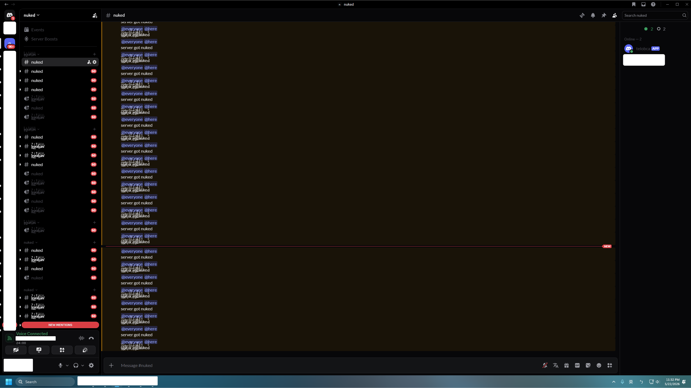

# Discord Nuke Bot
## Showcase


## Features
- Delete/Create roles
- Delete/Create text channels
- Delete/Create voice channels
- Delete/Create categories
- Delete/Change server icon
- Delete/Change server name
- Delete/Change server banner
- Delete stickers
- Delete emojis
- Delete server templates
- Delete System Channel
- Disable Verification Level
- Disable Content Filter
- Enable All Notifications
- Ban other bots
- Ban other members
- Send messages (webhook)
- Custom webhook avatar
- Ban other bots
- Ban other members
- Change members nicknames
- Give @everyone admin permission

## Installation
```bash
pip install -r requirements.txt
```

## Configuration
1. **`config.json`** file controls the bot behavior:
- `mix_voice_channels`: Create voice channels or not.
- `nickname_type`: "random_string": generate a random alphanumeric string;"random_list": select from the data.json configuration.

2. **`data.json`** file holds the random strings used during execution.
3. **`.env`** file for token.

## Usage
1. Run the bot:
```bash
python main.py
```

2. Invite bot to the server

If you didn't turn on `auto_nuke_on_join` and now need to use the command `!nuke server_id`

## Notes
- The bot requires **Administrator** permissions in the target server.
- Ensure the bot's role is placed as high as possible in the role hierarchy.

## Support
Join our Discord server for support and updates: [Discord Link](https://discord.gg/jWdvghHGj7)

## Disclaimer
For educational purposes only, users assume all risks and responsibility for legal and ToS compliance.
